# Comunicación en linea

---

# Comunicación sincróna y asincróna

---

# Sincróna

---

Los usuarios coinciden en el tiempo y se comunican entre sí

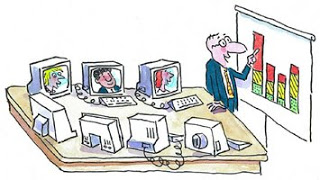

---

# Asincróna

---

Los participantes utilizan el sistema de comunicación en tiempos diferentes

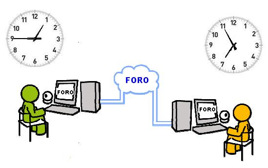

---

# Asíncrona

---

## El correo electrónico

---

email, del inglés, "electronic mail"

---

## Tipos de archivos que se pueden enviar por correo electrónico

---

### Archivos de video

---

### Archivos de audio

---

### Imágenes y fotografías

---

## Caracteristicas

---

## Rápido

---

## Fiable

---

## Cómodo

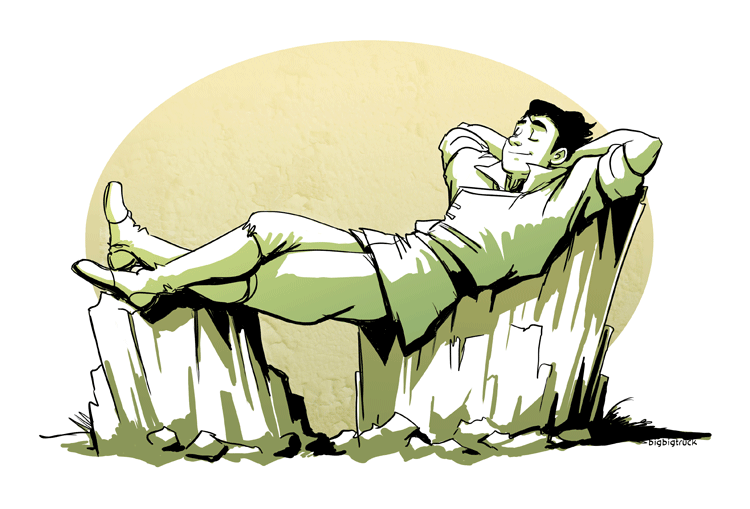

---

## Fácil de usar

 

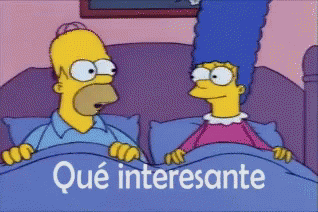

---

## Normas:

---

# Lectura del correo

---

# Identificar el asunto

---

# Identificarse como emisor

---

# Cuidar la expresión

---

# Concisión

---

# Evitar los envíos masivos de mensajes

---

# Controlar el tamaño de los mensajes

---

# Usar en la respuesta parte del texto recibido

---

# Mas usados:

---

# Gmail

---

# Outlook

---

# Yahoo! Mail

---

# Yopmail

 
[http://www.yopmail.com/es/](http://www.yopmail.com/es/)

---

## Foro

---

La gente comparte su opinión, experiencias y dudas sobre cualquier tema

---

# Síncrona

---

## Chat

---

Anglicismo que significa charla

 
 

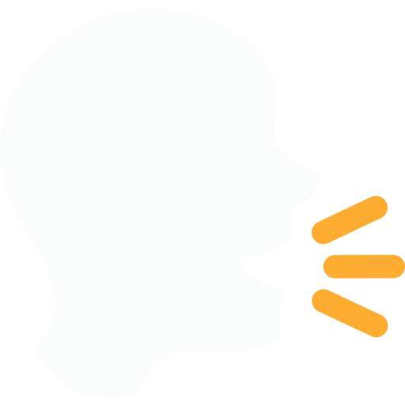 

---

Conversación simultánea entre dos o más personas conectadas a la red

---

Acceso a los mensajes enviados sin ningún tipo de retardo

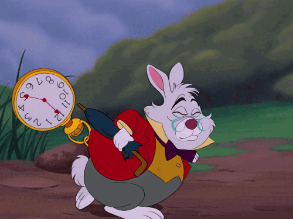

---

## Tipos de chat

---

### Chats privados

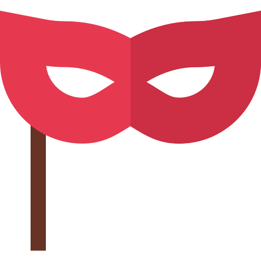

---

### Chats públicos

---

## Características

---

# Mensajes instantáneos

---

# Salón de Chat

---

# Enlaces Web

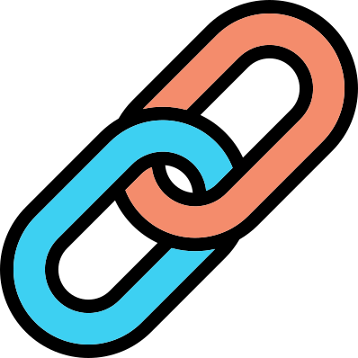

---

# Video

---

# Imágenes

---

# Audio

---

# Archivos

---

## Lenguaje en los chats

---

## Es habitual acortar las palabras, suprimir ciertas vocales o cambiar algunas letras por otras

---

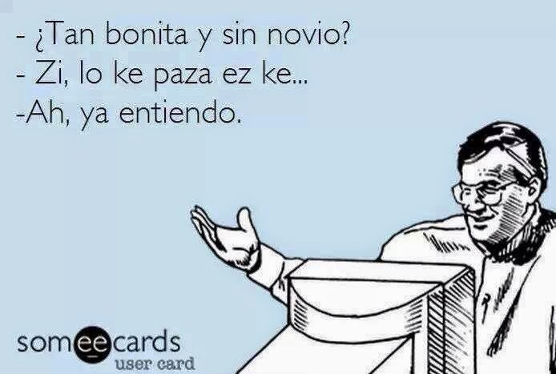

---

## Se utilizan emoticonos, emojis o stikers para expresar sentimientos

---

### Emoticonos animados

---

### Stickers

---

## Esto supone una merma evidente en la calidad del lenguaje

---

## Otros servicios de internet

---

# Videoconferencia

---

# Descarga de archivos
 

---

# Juegos Online

---

---

# Streaming

---

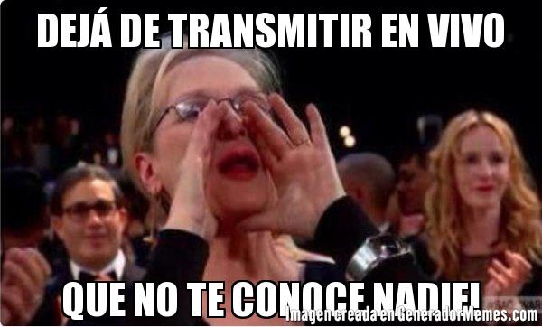

---

## Los emoticones

---

## Formados por caracteres del teclado de la computadora

:-)

---

## Ejemplo de emoticonos

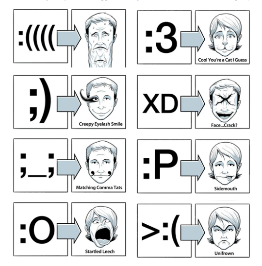

---

## Representan una emoción

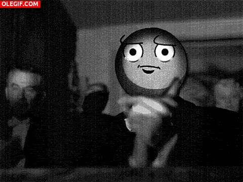

---

## Los emojis pueden representar eso y muchas cosas más: objetos, animales, deportes…

---

## Maniculas medievales

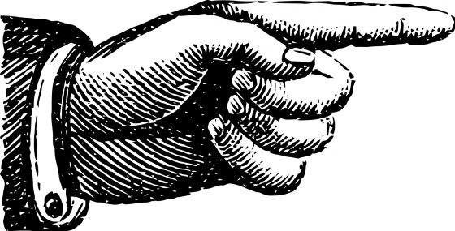

---

---

---

---

