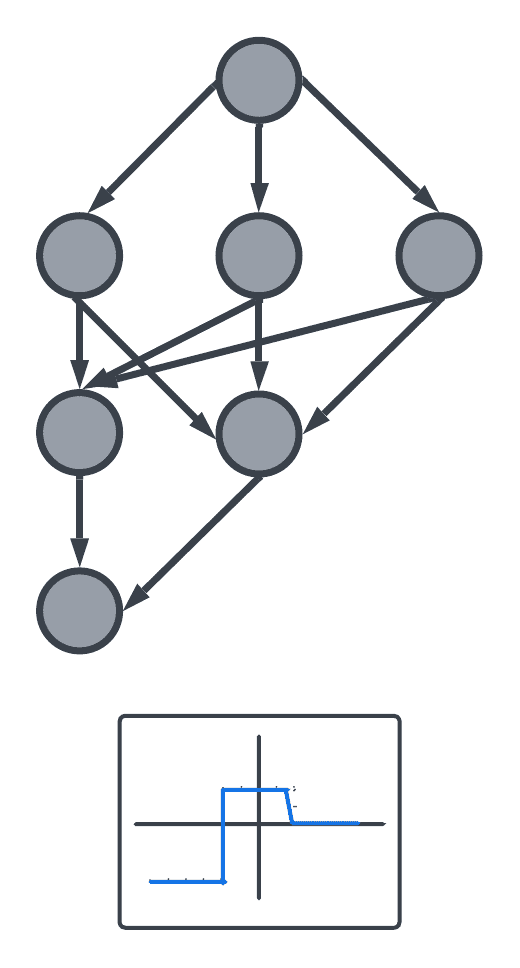
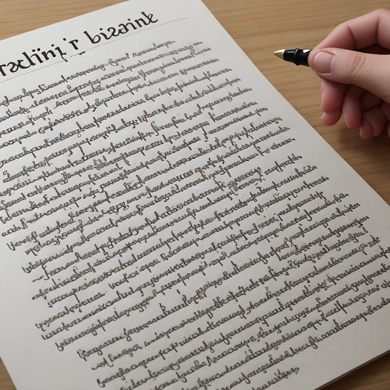

# La Magia de la IA

Introducción a la Inteligencia Artificial

---

# Introducción

<!--  diapositiva 1 -->

---

# ¿Qué es la Inteligencia?

Capacidad mental de **adquirir**, **procesar**, **comprender**, **aplicar** y **adaptar** el **conocimiento**

---

# **La neurona**

---

Axón manda señales electricas a través de las dendritas a otras neuronas, creando sinapsis

---

El cerebro contiene 10 mil millones de neuronas
Cada neurona envia 1000 impulsos por segundo
Cada neurona esta conectada a miles de otras

---

## 1000 veces mas sinapsis que la mayor IA actual... por ahora

---

#  ¿Qué es la Inteligencia Artificial?

Algoritmos y modelos permiten a la máquinas **analizar** datos, **aprender** y **decidir**.

---

# Funcionamiento de la IA

Máquina que **aprende**, resuelve problemas y reconoce patrones en datos.

---

# **Neurona artificial**

---

---

# Cerebro artificial más sencillo

---

# Cerebros artificiales 

---

---

 

---

 

---

# Perdida 

La medida de error en predicciones respecto a valores reales

---

# Machine Learning 

Crea sistemas que reconocen patrones, toman decisiones y mejoran con datos

---

# Historia y Evolución de la IA

---

De los primeros conceptos a la revolución actual

<!-- El Inicio de la Teoría (1950s)
- Alan Turing (1950): Publica una propuesta sugiriendo que las computadoras podrían alcanzar el pensamiento a nivel humano.
- El Test de Turing: Propuesto por Turing (originalmente llamado "Juego de la Imitación"), establece que una máquina es inteligente si una persona que conversa con ella a través de texto no puede distinguir si habla con un humano o con la máquina.
- John McCarthy (1956): Crea el término "Inteligencia Artificial" y promueve su investigación científica, creando también el lenguaje de programación LISP. -->

---

# Los Inviernos de la IA

---

1970 - 2000: Altibajos en la investigación

<!-- - Periodos en los que los gobiernos retiraron el financiamiento a la IA tras el informe Light Hill, que concluyó que la IA era "más promesa que realidad".
- La teoría existía, pero el hardware (poder de cómputo) era limitado.
- Redes Neuronales Profundas (1980s): Jeffrey Hinton introduce el concepto de redes neuronales multicapa.
- Problema del desvanecimiento de gradiente (pérdida de información) que se resolvería alrededor de 2006. -->

---

# La Revolución de la IA Generativa

---

2017 - 2022: La nueva era de la IA

<!-- - Arquitectura Transformer (2017): Investigadores de Google publican "Attention Is All You Need".
- Mecanismo de atención: Asigna un peso o importancia a cada palabra en el contexto.
- OpenAI: Fundada por Elon Musk y Sam Altman, crea GPT-1, GPT-2 y GPT-3.
- Lanzamiento de ChatGPT (Noviembre 2022): Basado en GPT 3.5, alcanzó 1 millón de usuarios en 5 días y 100 millones en menos de un mes. -->

---

# Tipos de IA

De la ficción a la realidad

---

# Inteligencia Artificial General (AGI)

IA capaz de aprender y realizar cualquier tarea intelectual humana

---

# Superinteligencia

Supera la inteligencia humana en todas las áreas

---

# Singularidad

Punto donde el desarrollo tecnológico escapa a nuestra comprensión

---

# Modelos de Lenguaje

---

## LLM (Large Language Models)

ChatGPT, Gemini, modelos masivos con capacidades complejas

---

## SLM (Small Language Models)

Gemini Nano, modelos compactos para dispositivos limitados

---

# Herramientas de IA Actuales

---

## Chatbots
- ChatGPT
- Gemini
- Meta
- Qwen
- Claude

---

## Generadores de Contenido
- Midjourney
- DALL-E 2
- Adobe Firefly
- Runway
- Nanobanana
- Sora2

---

## Generadores de musica

- Suno

---

## Asistentes de Desarrollo
- GitHub Copilot
- Tabnine
- Windsurf
- Cursor

---

## Investigación

- Perplexity
- NotebookLM

---

# Prompt Engineering

---

## La Habilidad del Siglo XXI

<!-- - La IA es como un "adolescente rebelde": a veces hace caso, a veces no, y es impredecible.
- El reto no es usar la IA, sino dominarla para que haga exactamente lo que el usuario quiere.
- El Prompt Engineering es el conjunto de técnicas para escribir instrucciones correctas. -->

---

# La IA es Impredecible

<!-- - La IA es como un "adolescente rebelde": a veces hace caso, a veces no, y es impredecible.
- El reto no es usar la IA, sino dominarla para que haga exactamente lo que el usuario quiere.
- El Prompt Engineering es el conjunto de técnicas para escribir instrucciones correctas. -->

---

# Un Buen Prompt

1. **Tarea**: Lo que se le pide a la IA
2. **Contexto**: Información de fondo necesaria
3. **Formato**: Cómo debe entregar la respuesta

<!-- - La estructura básica de un prompt consta de tres partes fundamentales: Tarea, Contexto y Formato.
- Tarea: Lo que se le pide a la IA.
- Contexto: Toda la información de fondo necesaria para que la IA entienda el objetivo.
- Formato: Cómo debe entregar la respuesta (ej. en una tabla, en 100 palabras). -->

---

# Comunicación Efectiva

- Claridad y Precisión
- Sin relleno innecesario
- Asignación de roles
- Técnica "Pregúntame"

<!-- - Claridad y Precisión: Ser claro y evitar ambigüedades.
- No Añadir Relleno: Ir directo al grano.
- Asignar un Rol: Dar contexto específico a la IA.
- Técnica "Pregúntame": Pedir a la IA que haga preguntas para clarificar. -->

---

# Consejos para Usar IA

---
## Todo lo que tú no le especifiques a la IA, la IA lo decidirá por ti.

---

## Precisión
Instrucciones claras y específicas

---

## Contexto
Información de fondo relevante

---

## Roles
Asignar roles específicos a la IA

---

## Ejemplos

---

# Aplicaciones de la IA en la Industria

Automatización de procesos, la optimización de la cadena de suministro y la transformación de la fabricación

---

.jpg)

# Aplicaciones de la IA en la Educación

Personaliza la enseñanza, adaptándola a las necesidades específicas de cada estudiante

---

# Aplicaciones de la IA en la Medicina

Asiste en el diagnóstico médico y mejora la precisión en el tratamiento de enfermedades

---

# Ejemplos de IA en la Vida Cotidiana

---

# Asistentes Virtuales

---

# Recomendaciones en Línea

---

# Motores de Búsqueda

---

# Traducción de Idiomas

---

# Detección de Fraudes

---

# Veiculos Autónomos

---

# Regulaciones y Normativas

Decisiones de IA impactan nuestras vidas

Garantizar rendición de cuentas y protección

---

# Ejemplos de Desafíos Éticos en IA

---

# Sesgo Algorítmico

Desafío ético, puede causar discriminación

---

# Privacidad y Datos Personales

IA recopila datos personales, la privacidad y transparencia son críticas

---

## Desplazamiento laboral

---

## Armas autónomas

---

## Derechos de autor y propiedad intelectual

---

## Adicción a la tecnología

---

## Autenticidad de los medios

---

# Principios Éticos en el Uso de la IA

---

## Transparencia

---

## Equidad y no discriminación

---

## Privacidad y protección de datos

---

## Beneficio social

---

## Seguridad

---

## Diseño ético

---

## Colaboración internacional

---

## Educación y concienciación

---

# ¿Nos esta haciendo tontos?

<!-- - Estudio del MIT: Muestra menor actividad cerebral al usar IA para escribir ensayos
- La IA como herramienta: Similar a cómo la escritura y la calculadora generaron temores
- Importancia del pensamiento estratégico y la alfabetización crítica -->

---

# La IA y el Futuro del Trabajo

---

## Adaptación en la Era de la IA

<!-- - La IA podría destruir más puestos de los que crea
- Impacto diferente según el tipo de trabajo (cuello azul, rosa y blanco)
- Importancia de adaptarse y usar la IA como aliada -->

---

# Estrategias de Adaptación

---

1. Aprender a usar la IA efectivamente
2. Desarrollar habilidades de pensamiento crítico
3. Enfocarse en lo humano: creatividad y empatía
4. Dominar el prompt engineering

<!-- - Subirse a la ola de la IA
- Usar la IA como socio, no como reemplazo
- Desarrollar habilidades complementarias a la IA -->

---

# Reflexión Final

---

## La IA no es el fin del trabajo humano,
## es el comienzo de una nueva forma de crear valor

<!-- - La IA es una herramienta poderosa que puede potenciar nuestras capacidades
- El verdadero valor está en cómo la usamos y en lo que hacemos con ella
- El futuro pertenece a quienes sepan combinar inteligencia humana e artificial -->
