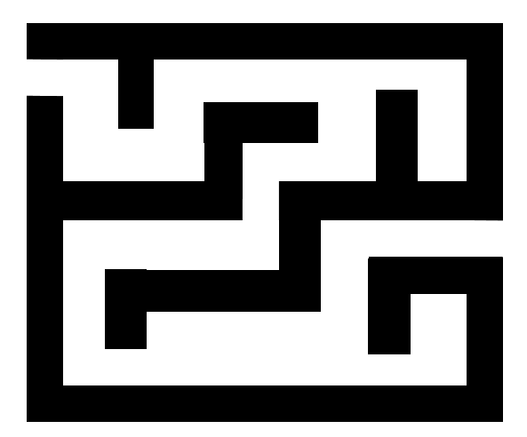
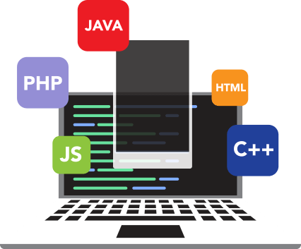
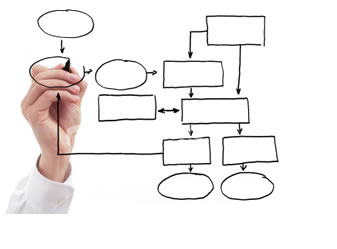
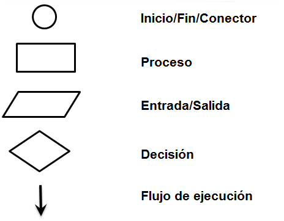
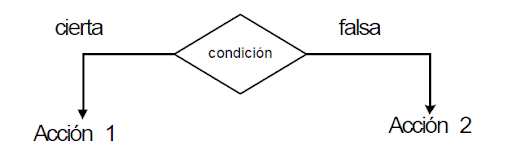
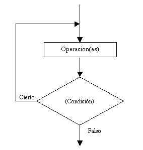
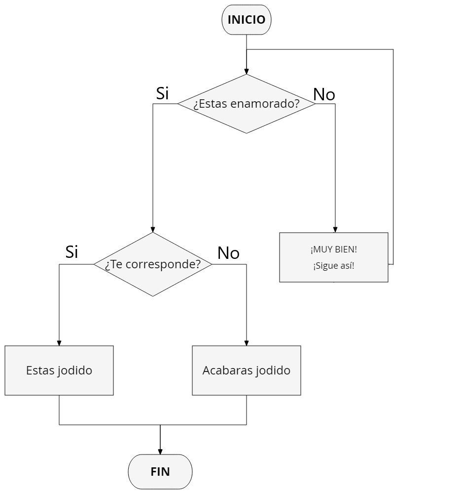
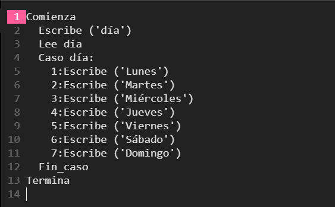

# Algoritmos

---

---

## Lógica computacional

---

## Algoritmo
 

---

## *"Conjunto finito y ordenado de pasos que deben llevarse a cabo para producir la solución a dicho problema"*
 

---

# El conejo y las zanahorias
 

---

# Pasos para solucionar un problema

---

## 1.- Diseño del algoritmo
 

---

## 2.- Expresar el algoritmo como un programa
 

---

## 3.- Ejecución y validación
 

---

# Características

---

## La completa ejecución de un algoritmo debe finalizar con la producción del resultado esperado a partir de las entradas proporcionadas

---

---

## El orden en que se disponen los pasos del algoritmo debe ser riguroso

---

## Un algoritmo puede expresarse en lenguajes diferentes de programación
 

---

# Propiedades:

---

## Un algoritmo debe ser preciso
 

---

## Un algoritmo debe estar definido.

---

## Un algoritmo debe ser finito.
 

---

# Ejemplos de algoritmos

---

Se quiere abrir una puerta, la persona se encuentra frente de ella, tiene la llave que abre. ¿Qué pasos requiere seguir para abrirla?

---

---

## Calcular el área y el perímetro de un rectángulo

---

---

# Diagramas de flujo

---

Representación gráfica de un algoritmo

 

---

## Suma de dos numeros

---

---

## Elementos de un diagrama de flujo

---

## Decisión simple:

---

---

## Decisión múltiple:

---

---

## Bucle

---

---
# Características

---

## 1. Debe ser de arriba hacia abajo

---

## 2. Debe tener un inicio y un fin

---

## 3. Las líneas de flujo para indicar la dirección del flujo de información deben ser rectas

---

## 4. Todas las líneas de flujo que se utilizan para indicar la dirección deben estar conectadas a algún símbolo

---

## 5. La notación utilizada debe ser independiente del lenguaje de programación

---

## 6. No debe de llegar más de una línea a un símbolo

---

---

---

---

# Pseudocódigo

---

## Escritura en lenguaje natural de una secuencia de pasos numerados

---

## Lenguaje estructurado y cercano a lo que será finalmente el programa de computadora

---

## Es un lenguaje para la especificación de algoritmos

---

# Palabras reservadas (inglés)
## begin, read, write, if-then, if-then-else, while-end, do-while, repeat for-to y end

---

# En español:
## inicio, leer, escribir, si-entonces, si-entonces-sino, mientras-hacer, hacer-mientras, repetir desde-hasta y fin

---

# Características:

---

## El pseudocódigo es compacto

---

## Puede modificarse fácilmente

---

## Se utilizan palabras claves en mayúsculas en español

---

## Se construye de manera estructurada

---

## No existen reglas estándar para utilizarlo

---

## No se tiene una representación gráfica de la lógica del programa

---

## No puede ser representado en una computadora

---

# Ejemplos

---

## Pseudocódigo de la suma de dos números

---

---

## Dado un número del 1 al 7, decir qué día de la semana es, partiendo de que el lunes es 1

---

