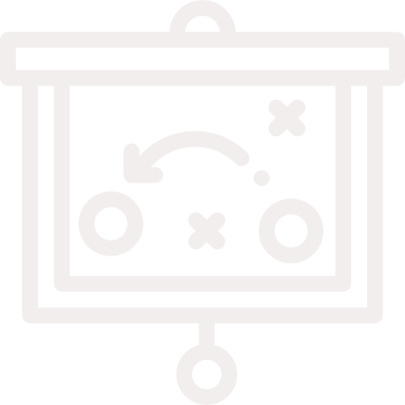
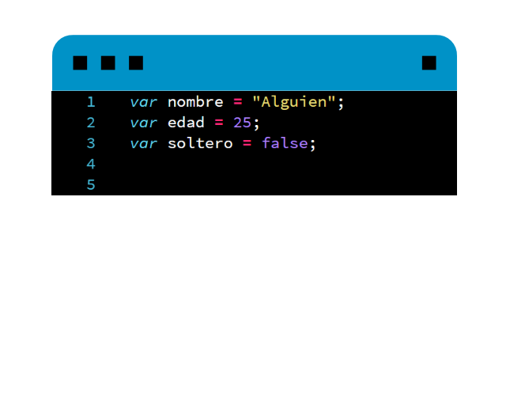
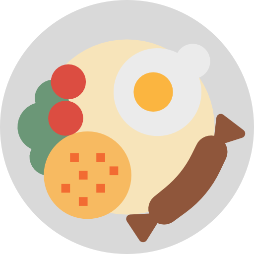
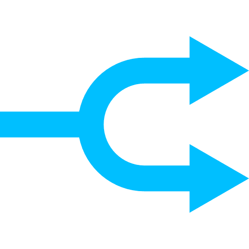
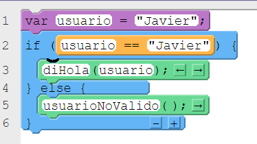

# Programación

---

# ¿Por qué programar?

---

Desarrolla una serie de habilidades, como el pensamiento analítico o de solución de problemas

---

# Programa

---

Instrucciones u órdenes que le indican a la computadora cómo se realiza una tarea

---

Un programa es una descripción ejecutable de soluciones a problemas computacionales

---

# Programar

---

Indicar a la computadora qué es lo que tiene que hacer

---

Decirle a un tonto muy rápido exactamente lo que tiene que hacer

---

# Lenguajes de programación

---

Es un conjunto de símbolos (sintaxis) y reglas (semántica) que permite expresar programas

---

## Se pueden clasificar de la siguiente manera:

  Lenguaje de máquina
  Lenguaje de bajo nivel
  Lenguaje de alto nivel

---

# Variable

---

## Cajas para guardar datos

---

---

# Constante

---

## No varía, siempre es la misma

---

---

# Tipos de datos

---

---

# Funciones

---

---

---

---

---

---

# Condicionales

---

---

# Ciclos

---

