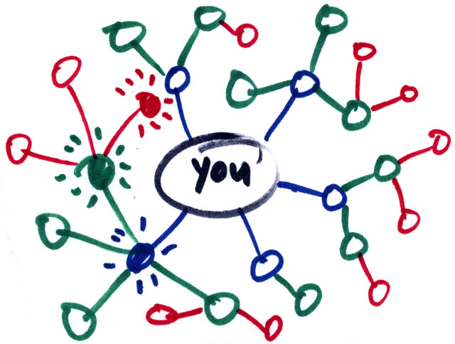

# Redes Sociales

---

Comunidades de individuos (en internet) con intereses o actividades en común.

---

Los individuos no se tienen que conocer previo a tomar contacto.

 

---

# Tipos de Redes Sociales

---

## Genéricas

---

Muy numerosas y populares (como Facebook o Twitter).

---

## Profesionales

---

---

LinkedIn: involucran individuos que comparten el ámbito laboral.

 

---

## Temáticas

---

Relacionan personas con intereses específicos en común siendo la más famosa Flickr.

---

# Primera red social

---

## [classmates.com](https://www.classmates.com/)

Creada en 1995 por Randy Conrads.

---

Buscaba mantener en contacto a ex compañeros de universidad.

---

# Teoría de los seis grados

---

Cualquiera en la Tierra puede estar conectado a cualquier otra persona en el planeta a través de una cadena de conocidos que no tiene más de seis intermediarios

---

Cada persona conoce de media a unas 100 personas.

---

# FACEBOOK

---

Los estudiantes creaban grupos para compartir resúmenes, noticias, retc.

---

# TWITTER

---

El nombre original del producto era twttr.

---

Microblogging: hay que limitarse a postear en 280 caracteres.

---

# YouTube 
.png)

---

---

# Instagram 

---

---

---

# Reddit 

---

---

## Ashley Madison

---

---

Plataforma para contactar a otras personas que estén dispuestas a cometer una infidelidad.

---

Mandar el primer correo electrónico te costará 5 créditos.

---

El costo de las conversaciones aplica solo para los hombres.

---

Bots femeninos.

---

