<!-- _class: lead -->
# Seguridad Informática

---

<!-- Diapositiva 1 -->

## Sistema seguro

---

<!-- Diapositiva 2 -->

# Libre de...

---

<!-- Diapositiva 3 -->

# Peligro

---

<!-- Diapositiva 4 -->

# Riesgo

---

<!-- Diapositiva 5 -->

# Daño

---

<!-- Diapositiva 6 -->

#  _Ningún sistema es infalible_

---

<!-- Diapositiva 7 -->

# Fiabilidad informática

---

<!-- Diapositiva 8 -->

## Objetivos

---

<!-- Diapositiva 9 -->

## Confidencialidad

---

<!-- Diapositiva 10 -->

## Integridad

---

<!-- Diapositiva 11 -->

## Disponibilidad

---

<!-- Diapositiva 12 -->

# Proteger

---

<!-- Diapositiva 13 -->

## Hardware
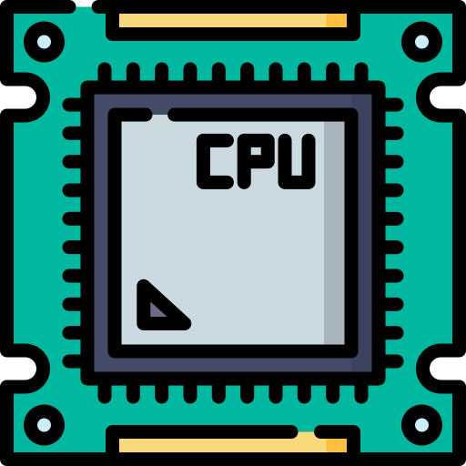

---

<!-- Diapositiva 14 -->

## Software

---

<!-- Diapositiva 15 -->

## Datos

---

<!-- Diapositiva 16 -->

# Amenazas

---

<!-- Diapositiva 17 -->
## Personas

---

<!-- Diapositiva 18 -->
## Pasivos

---

<!-- Diapositiva 19 -->
## Accidentes

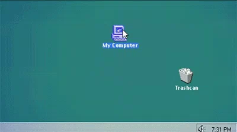

---

<!-- Diapositiva 20 -->
## Hackers
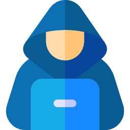

---

<!-- Diapositiva 21 -->
## Curiosos

---

<!-- Diapositiva 22 -->
## Activos

---

<!-- Diapositiva 23 -->
## Antiguos empleados

---

<!-- Diapositiva 24 -->
## Crackers

---

<!-- Diapositiva 25 -->
## Piratas informáticos

---

<!-- Diapositiva 26 -->
# Amenazas lógicas

---

<!-- Diapositiva 27 -->
## Intencionadas

---

<!-- Diapositiva 28 -->
## Virus y malware

---

<!-- Diapositiva 29 -->
## Herramientas de seguridad
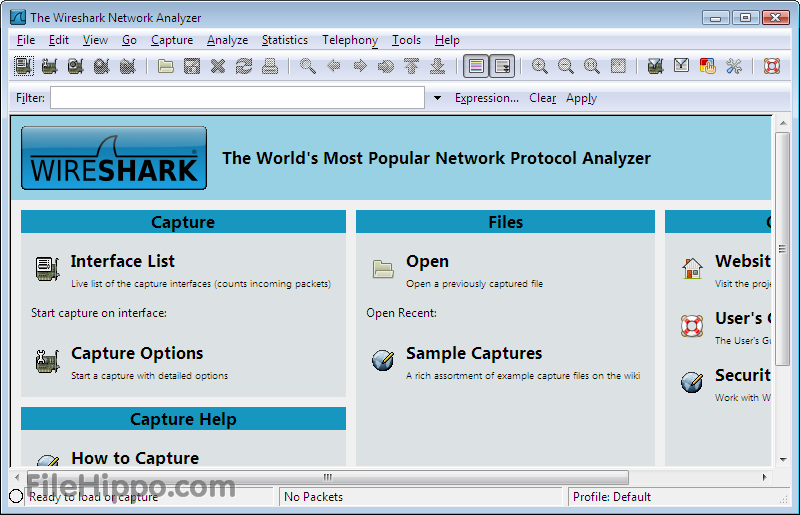

---

<!-- Diapositiva 30 -->
## Puertas traseras
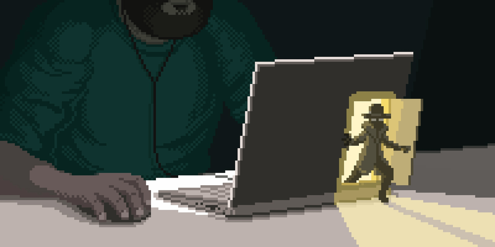

---

<!-- Diapositiva 31 -->
## Software incorrecto (Bugs)

---

<!-- Diapositiva 32 -->
## Amenazas Físicas

---

<!-- Diapositiva 33 -->
# Medidas de seguridad

---

<!-- Diapositiva 34 -->
## Prevención

---

<!-- Diapositiva 35 -->
## Contraseñas

---

<!-- Diapositiva 36 -->
## Permisos de acceso

---

<!-- Diapositiva 37 -->
## Seguridad de las comunicaciones
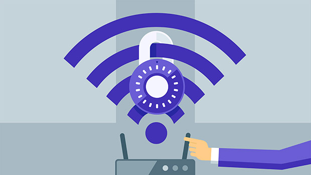

---

<!-- Diapositiva 38 -->
## Actualizaciones

---

<!-- Diapositiva 39 -->
# Detección

---

<!-- Diapositiva 40 -->
## Antivirus

---

<!-- Diapositiva 41 -->
## Firewalls y proxis

---

<!-- Diapositiva 42 -->
## Tor o redes VPN
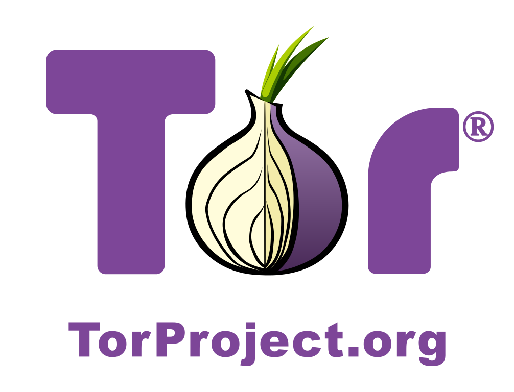

---

<!-- Diapositiva 43 -->
# Recuperación

---

<!-- Diapositiva 44 -->
## Respaldos

---

---

<!-- Diapositiva 45 -->
# Ingeniería Social

---

<!-- Diapositiva 46 -->
## Conductas que permiten obtener información confidencial

---

<!-- Diapositiva 47 -->
## Timo o fraude

---

<!-- Diapositiva 48 -->
## Robo de empleados

---

<!-- Diapositiva 49 -->
## Phishing

---

<!-- Diapositiva 50 -->
## Spoofing

---

<!-- Diapositiva 51 -->
## Evitar ataques

---

<!-- Diapositiva 52 -->
## Comprobar autenticidad
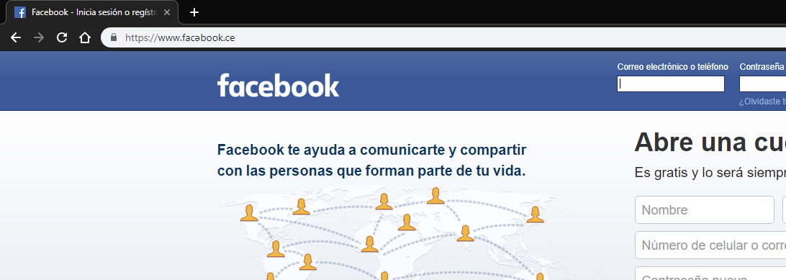

---

<!-- Diapositiva 53 -->
## Analizar correo electrónico

---

<!-- Diapositiva 54 -->
## No responder solicitudes

---

<!-- Diapositiva 55 -->
# Nunca se debe solo tirar documentación sensible

---

<!-- Diapositiva 56 -->
# Contraseñas

---

<!-- Diapositiva 57 -->
## Fáciles de recordar, Difíciles de adivinar
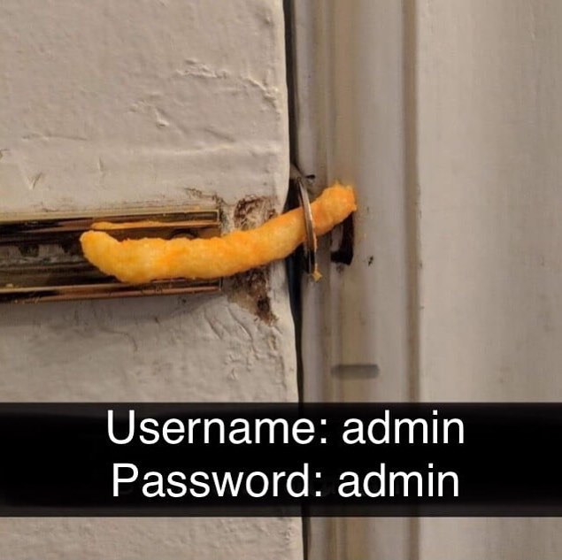

---

<!-- Diapositiva 58 -->
## Aa-Zz 0-9 !"#$%&/()=?

---

<!-- Diapositiva 59 -->
## Evitar secuencias de números o letras, así como caracteres repetidos

---

<!-- Diapositiva 60 -->
# Protección de la información

---

<!-- Diapositiva 61 -->
## Encriptación

---

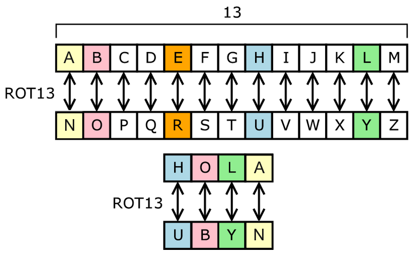

---

<!-- Diapositiva 62 -->
# Ejemplos

---

<!-- Diapositiva 63 -->
## Fuerza bruta

---

<!-- Diapositiva 64 -->
## RubberDucky

---

<!-- Diapositiva 65 -->
## Phishing

---

<!-- Diapositiva 66 -->
## Llaves electrónicas

---

<!-- Diapositiva 67 -->
## Femtoceldas

---

<!-- Diapositiva 68 -->
## Ransomware

---

<!-- Diapositiva 70 -->
## Keylogger

---

<!-- Diapositiva 72 -->
## Memorias "perdidas" o "enviadas"
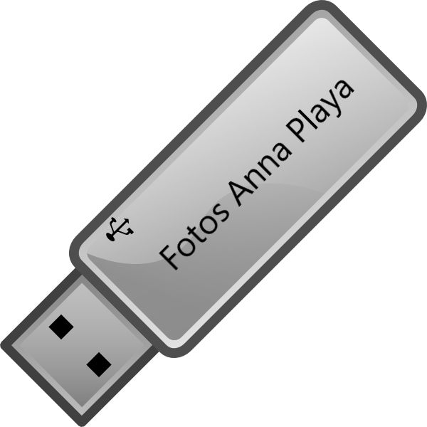

---

<!-- Diapositiva 73 -->
## No confiar en nadie
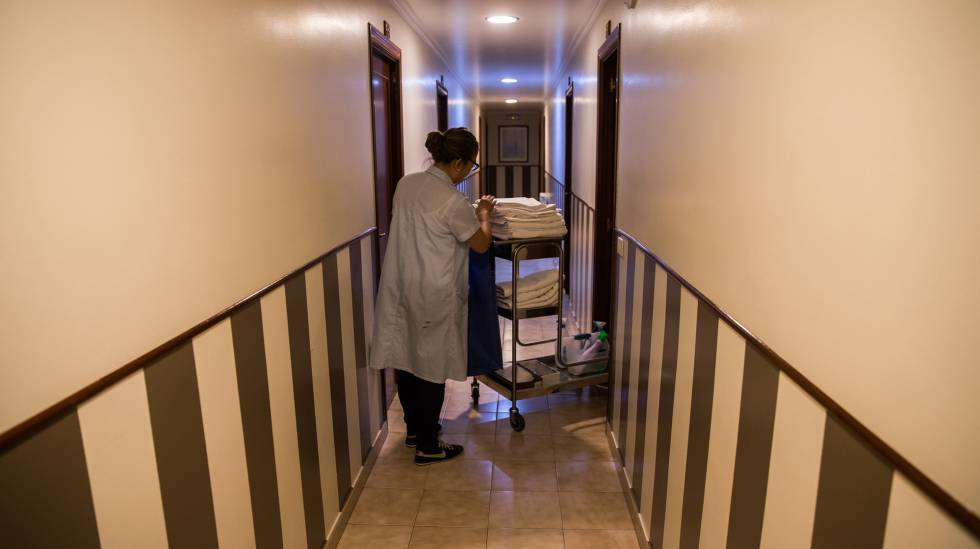
